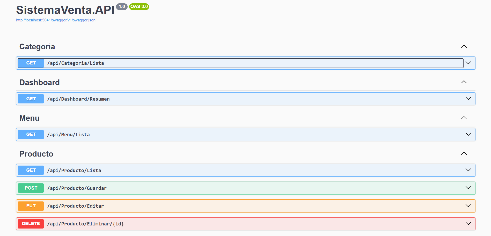

# API Sistema de Control de Inventario

Este proyecto es una API desarrollada con ASP.NET Core 8 y SQL Server 
que permite gestionar el control de inventario de una tienda.
A continuación, se detalla el proceso de instalación y configuración para ejecutar el proyecto localmente.

---

## Requisitos

Antes de comenzar, asegúrate de tener instalado lo siguiente en tu sistema:

- [.NET SDK 8.0](https://dotnet.microsoft.com/download/dotnet/8.0)
- [SQL Server](https://www.microsoft.com/sql-server)
- [Git](https://git-scm.com/)
- [Visual Studio 2022](https://visualstudio.microsoft.com/) o cualquier IDE compatible con .NET
- [Postman](https://www.postman.com/) u otra herramienta para probar endpoints (opcional)

---

## Instalación

Sigue los pasos a continuación para configurar el proyecto localmente:

### 1. Clonar el repositorio
Abre una terminal y ejecuta el siguiente comando para clonar el proyecto en tu máquina local:

```bash
git clone https://github.com/Pedrohumberto01/API-SistemaControl-Inventario.git
```

### 2. Abrir la carpeta del proyecto con visual studio 2022
```bash
cd API-SistemaControl-Inventario
```

## 3. Configurar la base de datos

Sigue estos pasos para configurar la base de datos:

1. **Abrir SQL Server Management Studio (SSMS)** o cualquier herramienta que utilices para administrar tu instancia de SQL Server.
2. Navega a la carpeta `DB-SQLSERVER` en el repositorio clonado. Allí encontrarás los scripts necesarios para crear la base de datos y sus tablas.
3. Ejecuta los scripts en el siguiente orden:

   - `SQLQueryDb.sql`: Este script crea la base de datos. Asegúrate de ejecutar esto primero.
   - `SQLQueryInsertDb.sql`: Este script carga datos iniciales para pruebas.
---

## 4. Configurar la cadena de conexión

Actualiza la cadena de conexión en el archivo `appsettings.json` si es que se creó en un servidor remoto, en caso contrario dejar por defecto

```json
"ConnectionStrings": {
        "CadenaSql": "Server=localhost\\SQLEXPRESS; Database=DBVENTA; Trusted_Connection=True; TrustServerCertificate=true;"
}
```


### 5. Ejecuta el proyecto desde Visual Studio

## 6. Vista previa de la API

Aquí hay una captura de pantalla de la API ejecutándose localmente:



